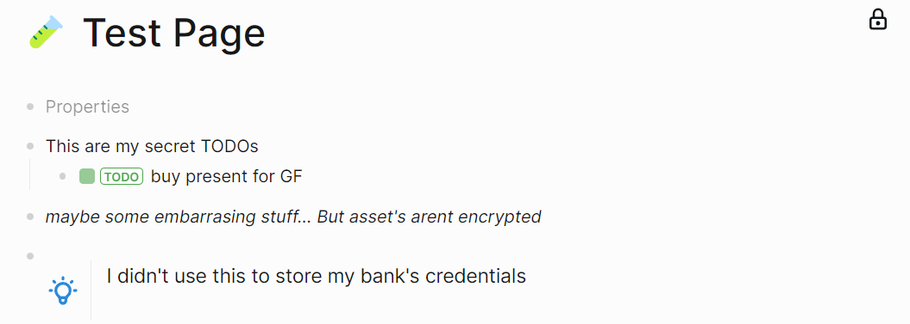
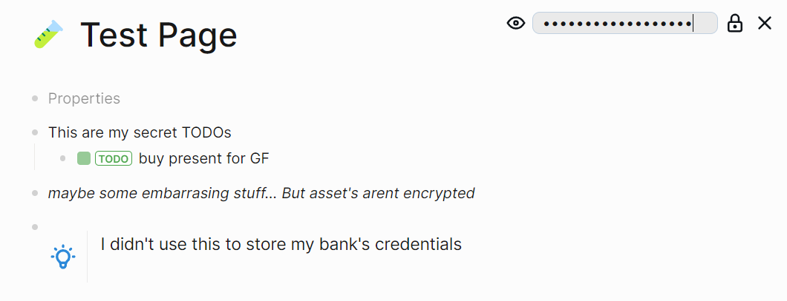
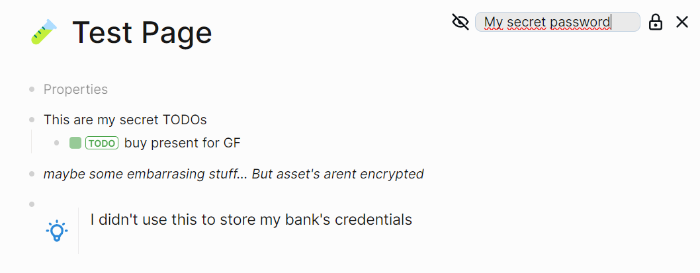
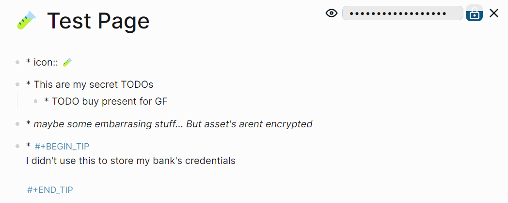
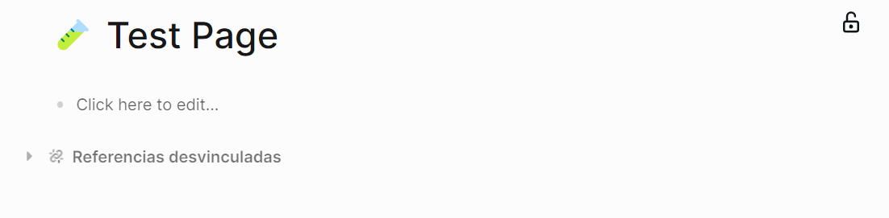
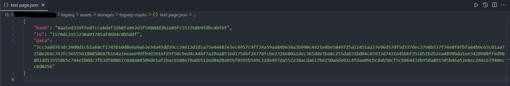
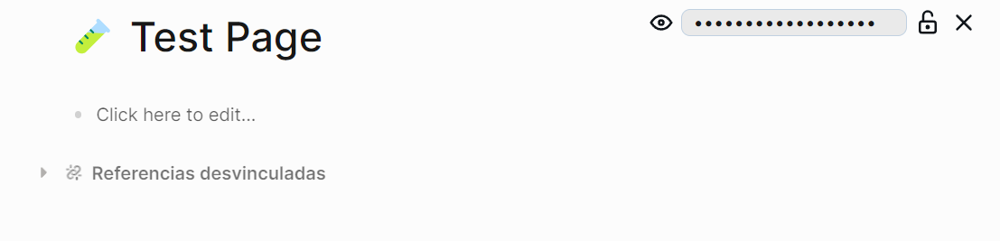

<h1 align="center">Logseq Crypto</h1>

    

## Purpose
Plugin to easily protect certain pages by encrypting his content.

## Disclaimer
- This is a beta version, it should be safe but be carefull with your data.
- Probably is not a good idea to store your bank credentials using this tool.
- Undo (ctrl + z) could restore your blocks, I can't prevent this yet. Closing the app cleans undo queue anyway.

## Usage
- 1. On the top-right corner of every page title a small lock will let you open the crypto-menu

- On this menu you can write your password, keep it safely.

- Using the eye icon on the left you can hide and unhide your password

- **To avoid unintended encryptions, you had to hold button 1 second**

- Your content will be deleted of the page, now the lock icon indicates that this should be decrypted

Don't worry, ypur blocks are saved on your graph `./assets/storages` folder.

- Introduce your password, push decrypt button and your content will come back.
